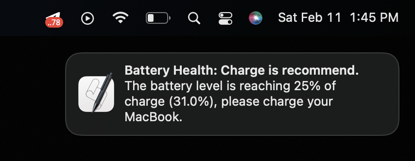

# Check Battery

Check the battery level and expose a notification.

## Example of notification

## TODO:

- [ ] Enable the cron (Unix only);
- [ ] Add logic to allow only two notification to avoid annoying behaviors;
- [ ] Test on Ubuntu;
- [ ] Investigate how to use this same environment workflow on Window machines;
- [ ] Add a small documentation layer about the Pattern Design use it (Strategy Pattern).
- [ ] Investigate how to stand by the notification for at least 5 secs. before hide.
